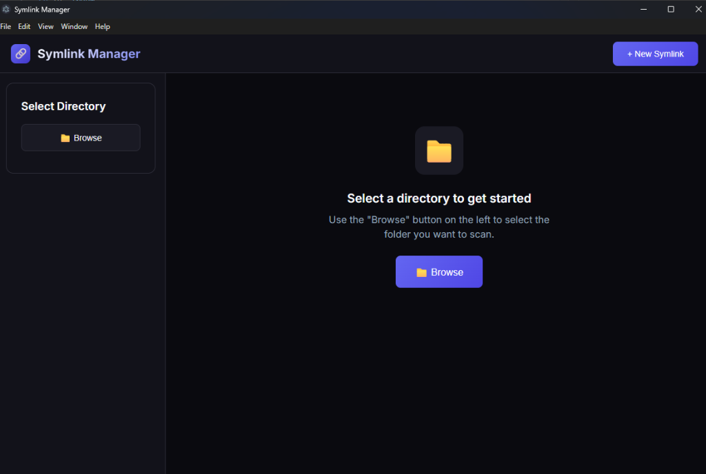

# 🔗 Symlink Manager

<div align="center">


**A modern, user-friendly symbolic link management application for Windows**

</div>

---

## ✨ Features

- 🔍 **Directory Scanning** - Automatically detect symbolic links in any folder
- ➕ **Create Symlinks** - Create new symbolic links for files or folders
- 🗑️ **Delete Symlinks** - Safely remove existing symbolic links
- ⚠️ **Broken Link Detection** - Automatically identify symlinks with missing targets
- 📊 **Statistics** - View total, valid, and broken link counts
- 🌙 **Modern Dark UI** - Beautiful dark theme that's easy on the eyes

---

## 📸 Screenshot

<div align="center">

</div>

---

## 🚀 Installation

### Requirements
- Node.js 18+
- npm or yarn

### Steps

```bash
# Clone the repository
git clone https://github.com/serdevir91/symlink-manager.git

# Navigate to directory
cd symlink-manager

# Install dependencies
npm install

# Start the application
npm run electron:dev
```

---

## 📦 Usage

### Quick Start

1. Click the **Browse** button
2. Select the folder you want to scan
3. Existing symbolic links will be listed automatically

### Creating a New Symlink

1. Click **+ New Symlink** button
2. Select the link type (File/Folder)
3. Choose the target file/folder
4. Specify where to create the symlink
5. Click **Create Symlink**

---

## 🛠️ Development

```bash
# Run in development mode
npm run electron:dev

# Web UI only (in browser)
npm run dev

# Lint check
npm run lint

# Production build
npm run electron:build
```

---

## 📁 Project Structure

```
symlink-manager/
├── electron/           # Electron main process files
│   ├── main.js         # Main process
│   ├── preload.js      # IPC bridge
│   └── symlink-service.js  # Symlink operations
├── src/                # React application
│   ├── App.tsx         # Main component
│   ├── index.css       # Styles
│   └── main.tsx        # Entry point
├── package.json
└── vite.config.ts
```

---

## ⚠️ Important Notes

- **Administrator Privileges**: Creating file symlinks on Windows may require administrator privileges
- **Junction**: Folder symlinks use `junction` type (doesn't require admin)
- **DevTools**: Press `Ctrl+Shift+I` to open developer tools

---

## 🤝 Contributing

1. Fork this repository
2. Create a feature branch (`git checkout -b feature/amazing-feature`)
3. Commit your changes (`git commit -m 'Add amazing feature'`)
4. Push to the branch (`git push origin feature/amazing-feature`)
5. Open a Pull Request

---

## 📄 License

MIT License - see [LICENSE](LICENSE) file for details.

---

<div align="center">

**⭐ If you like this project, don't forget to give it a star!**

</div>
